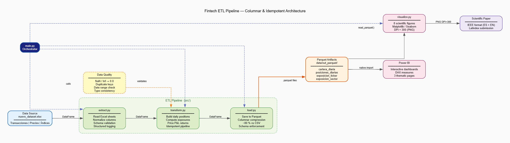

# FinTech ETL: Analítica y Riesgo de Portafolios

Arquitectura columnar, modular e idempotente para el análisis de riesgo de portafolios financieros. Este repositorio contiene un proceso ETL riguroso desarrollado en Python, diseñado para transformar datos transaccionales asíncronos en artefactos pre-computados de alto rendimiento (**Apache Parquet**), óptimos para exprimir la *Time Intelligence* de Power BI.

## Arquitectura del Sistema y Flujo de Datos



El diseño sigue una separación estricta en tres capas, garantizando la **idempotencia** y la **reproducibilidad** total de los datos.

1. **Capa de Ingesta (Extract)**
   - **Fuente de Datos:** Hojas de cálculo locales (`nuevo_dataset.xlsx`) con múltiples pestañas.
   - **Lectura Robusta:** Extracción mediante `pandas` validando la existencia de pestañas base (Transacciones, Precios, Índices) y normalización automática de las columnas al español.
   - **Contratos de Datos:** Diccionarios predefinidos garantizan compatibilidad hacia atrás y reglas sobre dominios de datos (fechas validables, numéricas tipificadas).

2. **Capa de Procesamiento (Transform)**
   - **Idempotencia Vectorizada:** Ejecuciones secuenciales sobre el mismo set resultan estrictamente en las mismas métricas sin generar duplicados u operaciones huérfanas o con estado mutable. 
   - **Valorización Diaria:** Mapeo de inventario histórico (`cumsum`) y precios pivotados usando la técnica `forward-fill` (propagación al día futuro) para resolver huecos de cotización cerrando con precio de mercado real.
   - **Densificación de Fechas:** Reconstrucción ininterrumpida de todo el calendario temporal para poder comparar fidedignamente la cartera contra los índices (*benchmarks*).
   - **Saneo Matemático Universal:** Prevención estricta de divisiones por cero o ruido analítico, al aislar transiciones sin capital previo, sanear valores `NaN` e `Inf`, y rebasear los acumulados relacionales a 1.0.

3. **Capa de Salida (Load y Visualize)**
   - **Artefactos Columnares (Apache Parquet):** Exportación en módulos supercomprimidos independientes (`cartera_diaria`, `posiciones`, etc.). Comprime el peso de lectura un $80\%$ y preserva los *types* nativos evitando costosos pasos de formateo cruzado en BI.
   - **Módulo de Visualización Científica:** `visualize.py` genera automáticamente 8 figuras exploratorias en alta resolución (DPI=300) listas para publicación académica o adjuntar al reporte.
   - **Trazabilidad de la Calidad:** Modelado preparado para adjuntar reportes de Data Quality y auditar la integridad.

## Métricas Financieras y de Riesgo

El motor matemático central extrae información contextual profundizando en la teoría de **Media-Varianza** e indicadores de mercado:

- **Desempeño Acumulado (Portfolio vs Benchmark):** Cálculo automatizado rebaseando los retornos y el benchmark respecto al primer día donde realmente existe fondeo activo en la cuenta. Permite evaluar claramente si el portafolio supera al mercado.
- **Riesgo por Volatilidad y Varianza:** Extracción en ventana de la covarianza y la varianza cruda ($\sigma^2$) presentes en retornos por cuenta y por activo, siendo la base para identificar distribuciones paramétricas y saltos de régimen (e.g. *rolling volatility* de 21 días).
- **Exposición Dinámica Factorial:** Promedio de pesos representativos agrupados (`peso`, `valor_promedio`) por sector tecnológico primario y ticker; evitando que un único precio bursátil sobredimensione transitoriamente las lógicas de concentración del tablero y las gráficas "Donut".
- **Retornos Diarios Determinísticos:** Rentabilidad intrínseca del portafolio generada sin ruidos creados por la inyección asincrónica externa del capital base.

## Características Técnicas

- **Ingeniería Modular Pura:** Refactorización orientada a objetos hacia un esquema productivo clásico (`extract.py`, `transform.py`, `load.py`), posibilitando Tests Unitarios en un futuro.
- **Core Pandas sin Apply:** Stack principal en Python con Pandas implementando rellenados y cruces de precios en la serie de tiempo puramente vectorizados.
- **Gestión Cloud-Native Agnostic:** Sistema desacoplado y libre de llaves privadas duras; listo para orquestarlo en instancias Dockerizadas (Cloud Run / Apache Airflow).

## Uso Rápido del Repositorio

La arquitectura no depende de Jupyter Notebooks para la producción. El orquestador general está listo para dispararse:

```bash
# 1. Instalar las dependencias core
pip install pandas numpy pyarrow requests openpyxl

# 2. Prender el motor ETL 
python src/main.py
```
> El resultado de grado analítico se emitirá en la raíz de la carpeta `data/out_parquet/`.

## Publicación Científica Oficial
La fundamentación teórica de este framework, su optimización matemática y escalamiento hacia Parquet se documentan de forma académica a través de nuestros Manuscritos de Investigación:
- **[EN PDF: Columnar and Idempotent Architecture for Financial Risk Analysis](docs/Reasco_Columnar_Idempotent_Architecture_2026.pdf)**
- **[ES PDF: Arquitectura Columnar e Idempotente para Análisis de Riesgo Financiero](docs/Reasco_Arquitectura_Columnar_2026.pdf)**
- **[EN Word/Forex Journal Format: Columnar and Idempotent Architecture for Financial Risk Analysis](docs/ETSA_Reasco_Columnar_Idempotent_Architecture_2026.pdf)**

> **Reproducibilidad Garantizada:** El código fuente completo, orquestador modular temporal y artefactos de visualización se encuentran preservados de forma íntegra en nuestro repositorio público: [**https://github.com/faritreascodev/fintech-etl-pipeline**](https://github.com/faritreascodev/fintech-etl-pipeline).

---
*Desarrollado y Supervisado por:*  
- Farit Alexander Reasco Torres (fareasco@pucese.edu.ec)
- Andres Ricardo Guanoluisa Plasencia (arguanoluisa@pucese.edu.ec)
